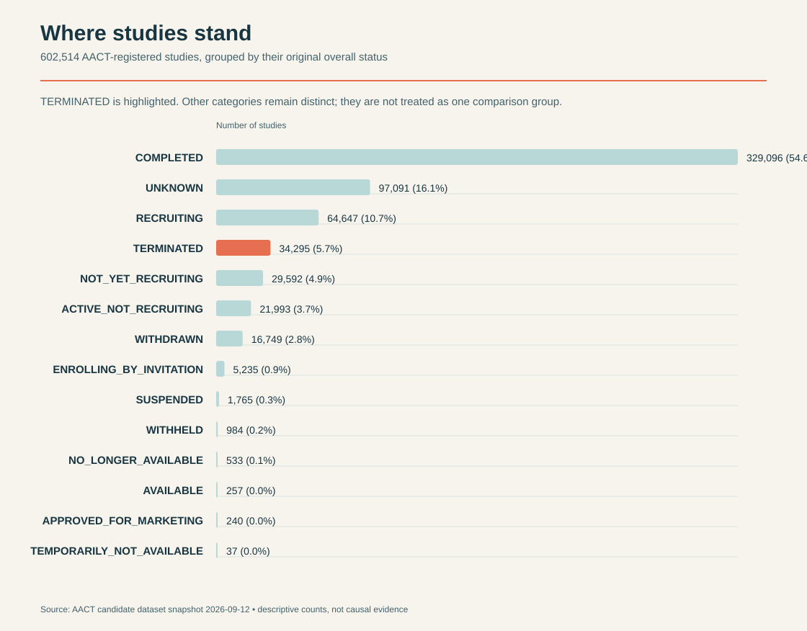

## Where studies stand

<div class="status-graphic">

</div>

This first-pass view uses the existing AACT candidate dataset and keeps every reported status category separate. It highlights `TERMINATED` without labeling the remaining studies as completed or implying that any status causes another.

## Are trials getting larger?

The status chart counts categories, but it cannot show the studies themselves. This view follows 575,628 trials with a reported positive enrollment and a start year from 1990 through 2026. The line is the median number of planned participants; the shaded band contains the middle half of trials in each year. Both are on a logarithmic scale because trial sizes range from a few participants to millions. The broad pattern is more useful than any single year: typical trial enrollment rises over much of the period, while the wide band shows that trials have never had one standard size.

```{r}
#| label: fig-home-enrollment
#| fig-cap: "The typical and middle 50% of reported trial enrollment by study start year"
#| fig-width: 12.5
#| fig-height: 5.8
#| echo: false
#| message: false
#| warning: false

library(ggplot2)
library(dplyr)
library(readr)
library(scales)

homepage_enrollment <- read_tsv(
  "data/processed/aact_trial_termination_candidate_2026-09-12.tsv.gz",
  show_col_types = FALSE,
  na = c("", "[missing]")
) |>
  mutate(
    start_year = suppressWarnings(as.integer(start_year)),
    enrollment = suppressWarnings(as.numeric(enrollment))
  ) |>
  filter(between(start_year, 1990L, 2026L), !is.na(enrollment), enrollment > 0) |>
  group_by(start_year) |>
  summarise(
    lower = quantile(enrollment, 0.25),
    median = median(enrollment),
    upper = quantile(enrollment, 0.75),
    studies = n(),
    .groups = "drop"
  )

ggplot(homepage_enrollment, aes(x = start_year)) +
  geom_ribbon(aes(ymin = lower, ymax = upper), fill = "#b8d8d8", alpha = 0.9) +
  geom_line(aes(y = median), color = "#e76f51", linewidth = 1.1) +
  geom_point(aes(y = median), color = "#183642", fill = "#e76f51", shape = 21, size = 2.3, stroke = 0.5) +
  scale_y_log10(labels = comma, breaks = c(10, 100, 1000, 10000, 100000, 1000000)) +
  scale_x_continuous(breaks = seq(1990, 2025, by = 5), expand = expansion(mult = c(0.01, 0.02))) +
  labs(x = "Study start year", y = "Reported enrollment") +
  theme_minimal(base_family = "DM Sans") +
  theme(
    panel.grid.minor = element_blank(),
    axis.text = element_text(color = "#183642"),
    axis.title = element_text(color = "#183642"),
    plot.background = element_rect(fill = "#f7f4ed", color = NA),
    panel.background = element_rect(fill = "#f7f4ed", color = NA)
  )
```
